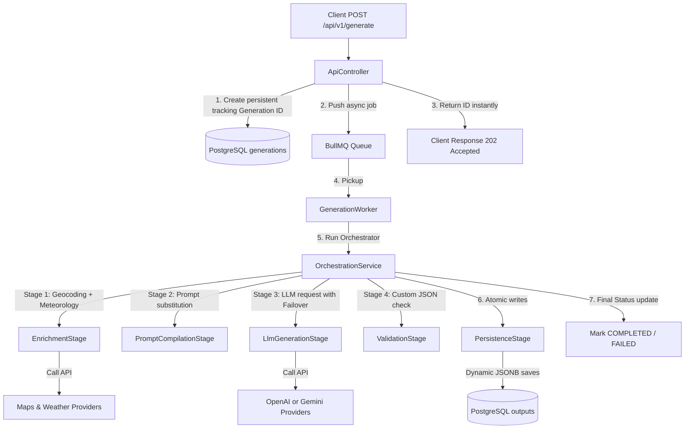

# YouGO Brain AI Orchestration Architecture

This document details the modular system design, stage boundaries, and dependency-decoupled provider architectures of the **YouGO Brain** platform.

## Architecture Philosophy

YouGO Brain is built on strict **SOLID design principles**, utilizing a decoupled, modular dependency-injection framework in NestJS to establish strong compile-time boundaries between:
- **API Interfaces** (asynchronous job reception)
- **Task Scheduling & Queues** (BullMQ + Redis isolation)
- **Decoupled Provider Interfaces** (interchangeable AI models, maps, and weather APIs)
- **Pipeline Execution Stages** (composable, discrete travel plan stages)
- **Persistence Layers** (Prisma ORM multi-tenant PostgreSQL schema isolation)

---

## High-Level Execution Pipeline



---

## Decoupled Provider Layer

All external integrations utilize an abstract interface architecture to prevent vendor lock-in. 

For example, the **BaseLlmProvider** standardizes all prompts and JSON parameters, allowing the orchestration stage to swap vendors seamlessly:

```typescript
export abstract class BaseLlmProvider {
  abstract generate(request: LlmRequest): Promise<LlmResponse>;
  abstract getName(): string;
}
```

Registered concrete providers:
1. **OpenAiProvider** (`gpt-4o`) - Primary LLM backend
2. **GeminiProvider** (`gemini-1.5-flash`) - Failover router backend
3. **GoogleMapsProvider** - Geocoding lat/lng mapper
4. **OpenWeatherProvider** - Free meteorological weather forecaster (uses Open-Meteo REST)

---

## Directory Schema

```text
yougo_brain/
├── prisma/                  # Database schema & migrations config
├── prompts/                 # Filesystem prompt templates
├── src/
│   ├── api/                 # DTOs and Queue dispatch controllers
│   ├── common/              # Global exception filters and typed errors
│   ├── configs/             # Zod environment variable parsing
│   ├── database/            # Global Prisma Client connection lifecycle
│   ├── observability/       # Telemetry cost logging & spans
│   ├── orchestration/       # State controllers for travel pipelines
│   ├── pipelines/           # Composable Stage classes (Enrichment, Persist, etc.)
│   ├── prompts/             # Dynamic prompt file loaded & substitutions
│   ├── providers/           # Abstract & concrete external API connectors
│   ├── queues/              # Redis and BullMQ connection pools
│   ├── schemas/             # Strict Zod schema structures for output
│   ├── validation/          # Sanitization & regex trailing-comma repairs
│   └── workers/             # Concurrency worker threads
```
