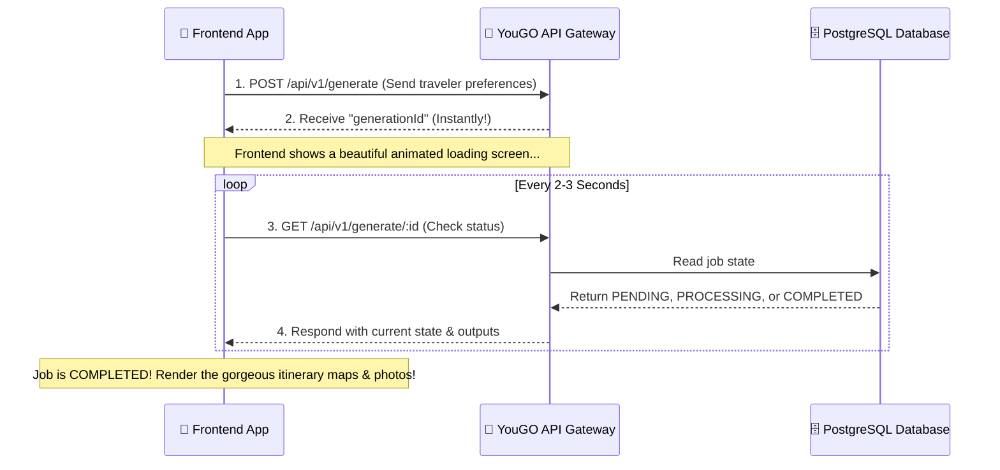

# YouGO AI Trip Planner - Frontend Integration Guide

Welcome! This guide explains exactly how to connect your user interface to the **YouGO AI Trip Planner API**. It is designed to be extremely easy, clear, and bulletproof. Even if this is your very first day writing code, you will understand exactly how to make this work!

---

## 🗺️ How it Works (The Big Picture)

Generating a highly personalized travel plan takes a little time (typically 5 to 15 seconds) because our AI performs real-time geo-mapping, checks weather, calculates driving routes, searches for beautiful photos on Unsplash/Pexels, and compiles day-by-day insights.

Because we don't want the user's browser connection to freeze or time out, we use an **Asynchronous (Background) Process**:



---

## 1. Requesting a Travel Plan (POST)

When your user clicks **"Generate My Trip"**, send a `POST` request to:
`POST http://localhost:3000/api/v1/generate`

### 📤 The Payload (What to Send)

Make sure you send a strictly formatted JSON payload containing all selected preferences.

Here is the exact format to copy:

```json
{
  "trip_details": {
    "origin": "Ghaziabad",
    "destination": "Manali",       // ⚠️ Can be empty string "" if the user wants YouGO AI to decide the destination!
    "startDate": "2026-06-15",     // YYYY-MM-DD format (so the AI calculates exact day-by-day calendar dates)
    "days": 4,
    "budgetINR": 45000,
    "isRoundTrip": true
  },
  "party_composition": {
    "totalPersons": 2,
    "travelers": [
      {
        "sex": "M",
        "age": 21
      },
      {
        "sex": "M",
        "age": 22
      }
    ]
  },
  "preferences": {
    "food_preference": "veg",      // "veg", "non_veg", or "any"
    "travel_style": "adventure",   // "adventure", "leisure", "cultural", "spiritual"
    "luxury_level": "moderate"     // "budget", "moderate", "luxury"
  },
  "travel_medium": {
    "mixed_best_suitable": false,  // Set to true if you allow the AI to mix trains, flights, & cars dynamically!
    "bike": {
      "selected": false,
      "type": "off_road",          // "normal_city", "sports", or "off_road"
      "sharing": "two_on_one",     // "individual" or "two_on_one"
      "ownership": "rented"        // "rented" or "personal"
    },
    "car": {
      "selected": true,
      "type": "suv",               // "suv", "sedan", or "hatchback"
      "ownership": "rented"        // "rented" or "personal"
    },
    "train": {
      "selected": false,
      "class": "general"           // "1AC", "2AC", "3AC", "sleeper", "chair_car", "general"
    },
    "flights": {
      "selected": false,
      "class": "economy"           // "economy", "business", "first"
    },
    "bus": {
      "selected": false,
      "class": "ac_sleeper"        // "ac_sleeper", "ac_seater", "non_ac", "volvo"
    }
  }
}
```

### 📥 The Response (What You Receive Instantly)

```json
{
  "status": "success",
  "message": "Travel generation job successfully queued",
  "data": {
    "generationId": "57b3ea6b-4e12-4ebf-8182-83b65bf87e91",
    "status": "PENDING"
  }
}
```

> [!IMPORTANT]
> Save the `generationId` in your state (e.g. React `useState` or Redux) so you can ask the server for updates!

---

## 2. Checking the Status (GET Polling)

Start querying the server every **2 to 3 seconds** using the `generationId` you received:
`GET http://localhost:3000/api/v1/generate/57b3ea6b-4e12-4ebf-8182-83b65bf87e91`

### 🔄 While it is Generating (Status: PENDING or PROCESSING)

The server will respond with the progress:

```json
{
  "status": "success",
  "data": {
    "generationId": "57b3ea6b-4e12-4ebf-8182-83b65bf87e91",
    "status": "PROCESSING",
    "error": null,
    "stepsCompleted": [
      { "stepName": "enrichment", "validationPassed": true },
      { "stepName": "llm-generation", "validationPassed": true }
    ],
    "output": null
  }
}
```

### 🎉 When It Is Complete (Status: COMPLETED)

When `status` becomes `"COMPLETED"`, the `"output"` field will contain the complete travel itinerary, fully loaded with actual driving routing distances and active Unsplash/Pexels image links.

Here is the exact structure of the finalized, frontend-safe response you will receive:

```json
{
  "status": "success",
  "data": {
    "generationId": "57b3ea6b-4e12-4ebf-8182-83b65bf87e91",
    "status": "COMPLETED",
    "error": null,
    "output": {
      "summary": {
        "destination": "Manali, Himachal Pradesh, India",
        "tripType": "4-Day Round Trip from Ghaziabad",
        "totalDays": 4,
        "totalPersons": 2,
        "travelers": [
          { "sex": "M", "age": 21 },
          { "sex": "M", "age": 22 }
        ],
        "experienceType": "Adventure & Mountain Exploration",
        "baseCurrency": "INR",
        "imageUrl": "https://images.unsplash.com/photo-1605649487212-4f7ccdb04934?q=80&w=1080"
      },
      "days": [
        {
          "day": 1,
          "date": "15/06/2026",
          "title": "The Ascent: Journey to the Valley of Gods",
          "route": "Ghaziabad, Chandigarh, Manali",
          "distance": "540 km",
          "travelTime": "12.5 hrs",
          "altitudeSeaLevel": "2050m",
          "predictedWeather": {
            "conditions": "Clear Skies / Cool Breeze",
            "temperatureHigh": "22°C",
            "temperatureLow": "12°C"
          },
          "transportDetails": {
            "type": "car (Rented)",
            "subType": "Mahindra Thar",
            "flightOrTrainNumber": "Not Applicable",
            "departureTime": "04:30 AM, 15/06/2026",
            "arrivalTime": "05:00 PM, 15/06/2026"
          },
          "destinationImageUrl": "https://images.unsplash.com/photo-1593118925567-33a817454807?q=80&w=1080",
          "accommodation": {
            "hotelName": "Zostel Manali (Old Manali)",
            "bookingPlatform": "Zostel.com",
            "bookingLink": "https://www.zostel.com/zostel/manali/",
            "pricePerPersonINR": 1600,
            "whyRecommended": "Vibrant backpacker vibe, safe parking for the SUV, and walking distance to cafes."
          },
          "experienceDescription": "Start your journey before dawn to beat the Delhi NCR traffic. The drive through the plains is fast, but real adventure begins as you hit mountain roads.",
          "dailyPacing": "Moderate",
          "dailyActivities": [
            {
              "name": "Old Manali Cafe Crawl",
              "detail": "Explore the cobblestone streets and eat at Cafe 1947.",
              "estimatedINR": 1200,
              "imageUrl": "https://images.unsplash.com/photo-1555396273-367ea4eb4db5?q=80&w=1080"
            }
          ],
          "costBreakdown": {
            "transportBaseINR": 3500,
            "fuelINR": 4500,
            "tollsINR": 650,
            "accommodationINR": 1600,
            "activitiesINR": 1200,
            "foodINR": {
              "breakfast": 300,
              "lunch": 700,
              "dinner": 1200
            }
          }
        }
      ],
      "costBreakdownFull": {
        "interCityTransportINR": 14000,
        "intraCityTransportINR": 0,
        "stayINR": 9600,
        "foodBreakdownINR": {
          "breakfast": 1100,
          "lunch": 2800,
          "dinner": 3300,
          "snacksAndDrinks": 1500
        },
        "activitiesINR": 4350,
        "hiddenCostsINR": {
          "fuelEstimatedTotal": 11300,
          "tollsAndTaxes": 1300,
          "tips": 500,
          "permits": 600
        }
      },
      "totalCostSummary": {
        "minimumCostINR": 35000,
        "safeCostINR": 40000,
        "maxCostINR": 45000,
        "perPersonINR": 20000
      },
      "travelInsights": {
        "bestExperiences": [
          "Driving a 4x4 SUV through the snow walls of Rohtang Pass.",
          "Evening cafe hops in Old Manali."
        ],
        "hiddenGems": [
          "Jogini Waterfall trek (early morning before the crowds).",
          "Sethan Village for an off-beat igloo experience."
        ],
        "cautionPoints": [
          "Altitude sickness at Rohtang Pass; stay hydrated.",
          "Mountain driving requires high skill; avoid driving after sunset."
        ],
        "bestTimeToVisit": "October to February for snow, March to June for pleasant summer escapes.",
        "sustainabilityTips": [
          "Do not leave plastic bottles at high-altitude passes.",
          "Respect the local Himachali culture and dress modestly near temples."
        ]
      },
      "logistics": {
        "packingList": [
          "Heavy winter jacket and thermals (for Rohtang).",
          "Sturdy driving shoes.",
          "Motion sickness pills.",
          "Polarized sunglasses."
        ],
        "healthAndSafety": [
          "Keep emergency car tools and a spare tire accessible.",
          "Save offline Google Maps as network drops frequently."
        ]
      },
      "survivalGuide": {
        "localAppsToDownload": [
          "Zoomcar (for vehicle management)",
          "AccuWeather"
        ],
        "emergencyContacts": [
          "Manali Police Station: 01902-252326",
          "Mission Hospital Manali: 01902-252235"
        ],
        "culturalNorms": [
          "Always ask before taking photos of local villagers.",
          "Leather is not allowed inside many ancient temples."
        ],
        "scamWarnings": [
          "Fake saffron sellers in the market.",
          "Overpriced snow-dress rentals on the way to Rohtang."
        ]
      }
    }
  }
}
```

---

## 🛡️ Frontend Safety Rules: Why You will Never Crash!

Normally, dealing with AI outputs is scary because the AI might forget to return some keys, causing `TypeError: Cannot read properties of undefined` in React or Vue. 

We solved this at the database level! Our backend has an **Auto-Repair Self-Healing Merger**:
1. If the AI misses a key like `flightOrTrainNumber`, our backend automatically detects it and sets its value to `"Not Applicable"`.
2. If it misses a numeric array or number, it sets it to `0` or `[]`.
3. **Every single key shown in the completed JSON above is 100% guaranteed to be present in every single response.** You do not need to write messy `if (output && output.costBreakdownFull)` checks! Just map and render!

---

## 👍 DO's and 👎 DONT's

### 👍 Do
- **Show a beautiful travel-themed loading screen**: Since this is an async operation, show a spinner, a progress bar, or tell the user: *"YouGO is looking up routes, geocoding maps, checking mountain weather, and curating photos..."*
- **Check stepsCompleted**: You can show the user what step is currently running by rendering the list inside `stepsCompleted` (e.g. showing a checkmark next to "Checked Coordinates", "Fetched Weather", "Written Itinerary").
- **Use the Image URLs directly**: The links inside `imageUrl` and `destinationImageUrl` are active, landscape, high-quality photos fetched directly from Unsplash or Pexels. Render them inside premium `` tags or cards!

### 👎 Don't
- **Do not query the status too fast**: Poll the GET endpoint every **2.5 seconds**. Sending requests every 100 milliseconds will spam the network and could result in rate-limiting.
- **Do not hardcode keys**: Rely completely on the dynamic keys returned. If you need to hide a "Not Applicable" text from the user, simply write a small conditional helper:
  `{details !== 'Not Applicable' && <p>{details}</p>}`

---

## 🛠️ Testing with mock/local server
To check if the API is working locally:
1. Fire up a terminal.
2. Send this exact request using `curl`:
```bash
curl -X POST http://localhost:3000/api/v1/generate \
  -H "Content-Type: application/json" \
  -d '{
    "trip_details": {
      "origin": "Ghaziabad",
      "destination": "Manali",
      "startDate": "2026-06-15",
      "days": 4,
      "budgetINR": 45000,
      "isRoundTrip": true
    },
    "party_composition": {
      "totalPersons": 2,
      "travelers": [
        { "sex": "M", "age": 21 },
        { "sex": "M", "age": 22 }
      ]
    },
    "preferences": {
      "food_preference": "veg",
      "travel_style": "adventure",
      "luxury_level": "moderate"
    },
    "travel_medium": {
      "mixed_best_suitable": false,
      "bike": { "selected": false },
      "car": { "selected": true, "type": "suv", "ownership": "rented" },
      "train": { "selected": false },
      "flights": { "selected": false },
      "bus": { "selected": false }
    }
  }'
```
3. Take the returned ID and curl the GET:
```bash
curl http://localhost:3000/api/v1/generate/YOUR_GENERATION_ID
```

You are all set! Have fun building this stunning AI Travel App! 🚗💨⛰️
