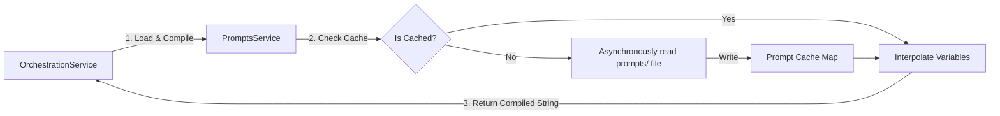

# Filesystem Prompt Management System

This document outlines the design decisions and implementation details of the filesystem prompt loading and compilation pipeline.

## Why Filesystem Prompts?

Hardcoding prompt templates inside Javascript string literals violates standard clean architecture guidelines:
1. **No business logic mixing**: Prompts are non-code configuration parameters that describe AI behavior. They should be isolated.
2. **Dynamic optimization**: Product managers or AI engineers can tweak and optimize prompts inside `.txt` files directly in production without re-compiling or building the NestJS binary!
3. **Traceability**: All prompt versions are tracked directly in Git history.

---

## Technical Flow



## Directory Design

Prompts are grouped cleanly in `/prompts` based on their role in the pipelines:
- `prompts/system/`: Core orchestrator instructions, behavior guidelines, and output schemas (e.g. `itinerary_planner.txt`).
- `prompts/planners/`: Target model planners (e.g. customized routes or budget planners).
- `prompts/modifiers/`: Refinement filters (e.g. post-weather injection or localized safety edits).

---

## Safe Caching and Compilation

The `PromptsService` caches loaded templates in-memory to prevent expensive disk I/O operations under heavy load. If a file is missing (e.g. in dynamic serverless environments), a **pleasant default fallback template** is automatically provided so that the travel pipeline never crashes:

```typescript
async compilePrompt(relativeFilePath: string, variables: Record<string, any>): Promise<string> {
  const template = await this.loadPrompt(relativeFilePath);
  let compiled = template;

  for (const [key, value] of Object.entries(variables)) {
    const regex = new RegExp(`{{${key}}}`, 'g');
    compiled = compiled.replace(regex, value !== undefined ? String(value) : '');
  }

  return compiled;
}
```
All variables are matched using standard `{{variable}}` handlebars formats.
